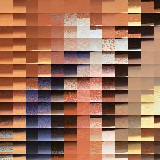
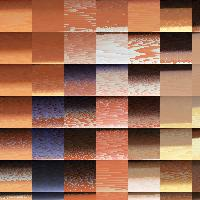
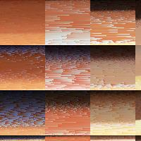
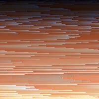

# AnticPan's scripts

1. [png2jpg](./png2jpg.py)

convert RGBA png to jpg.

|src|png2jpg|direct convert|
|-|-|-|
||||

1. [rerange_color](./rerange_color.py)

sort color in sliding windows.
|src|size-3|size-5|size-16|size-32|size-64|size-256|
|-|-|-|-|-|-|-|
||||||||

3. [reuse_port](./reuse_port.py)

providing multiple local services while only exposing one port to wan.

4. [reverse_en](./reverse_en.py)
reverse direction of words.

|1234567890|abcdefghijklmnopqrstuvwxyz|ABCDEFGHIJKLMNOPQRSTUVWXYZ|
|-|-|-|
|068ㄥ9ಽᔭƐᄅ⇂|zʎxʍʌnʇsɹbdouɯןʞ̣ɾ̣ıɥƃɟǝpɔqɐ|Z⅄XMꓥꓵꓕSꓤ̀OԀONWꓶꓘſIHꓨℲƎꓷƆꓭⱯ|

5. [sents_diff_vis](./sents_diff_vis.py)
   
highlight different words which are not in LCS.

|1&emsp;|Would <text style="color:red;">do </text>you <text style="color:red;">please </text>join us ?|Would you <text style="color:red;">like to </text>join us ?|
|-|-|-|